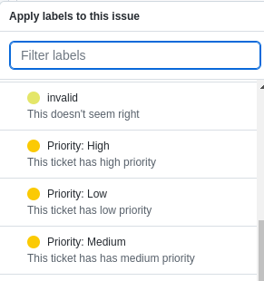
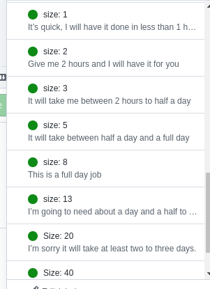
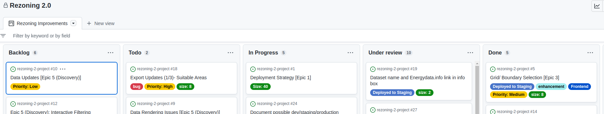

# GitHub issues: 

#### Tickets: 
Tickets on the [REZ Zoning 2 GitHub board](https://github.com/orgs/kartoza/projects/20) are created first as issues and converted into tickets to work on during the sprint at the REZoning catchup meeting. This workflow ensures work required by the client gets done as well as allows the opportunity to clear up any doubts as to work that needs to be done. When issues are created a clear description of what needs to happen is required as well as any accompanying screenshots or videos. If a developer has any doubt, he can simply comment on the ticket and the creator of the ticket as well as any assigned developers will be notified via e-mail. 

#### Labels:  

Each issue will have its priority assigned as a label. 

Each issue is sized according to its expected time to accomplish. Labels are rated by size with the following labels: 

 

* size [N/A] - Applied to issues where size is not applicable
* Size [1] - It's quick I will have this done in about 1 hour. 
* Size [2] - Give me 2 hours and I will have it for you. 
* Size [5] - It will take between half a day and a full day. 
* Size [8] - This is a full-day job. 
* Size [13] - I'm going to need about a day and a half to two days. 
* Size [20] - It will take at least two to three days. 
* Size [40] - This will take a full week. 

#### SCRUM Board: 
The order of issues on the SCRUM board will dictate the order of working on the tickets, meaning if the developer is blocked on a ticket he will default to working on the next ticket. 

